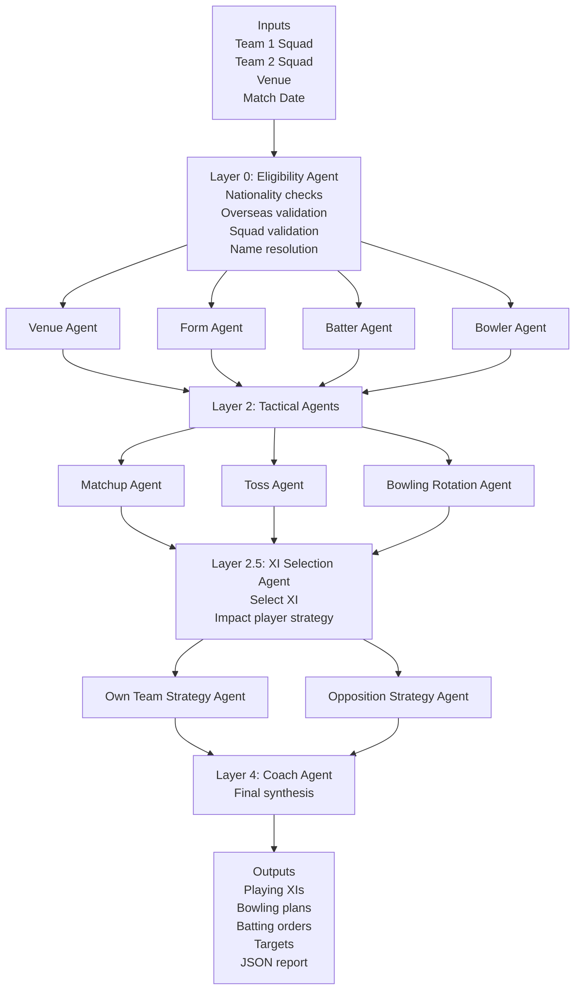

# Cricket Intelligence


Production-style IPL match intelligence built as a LangGraph multi-agent system. The project analyzes squads, venue conditions, form, matchup edges, toss decisions, bowling rotations, XI balance, and game strategy before synthesizing a final coach-ready report.

## Architecture

The system is organized as a 4-layer agent pipeline with typed shared state:

- Layer 0 validates squads, player roles, and overseas eligibility.
- Layer 1 fans out venue, form, batter, and bowler analysis in parallel.
- Layer 2 computes head-to-head matchups, toss strategy, and bowling rotation.
- Layer 2.5 selects the best XIs and impact-player plans.
- Layer 3 builds own-team and opposition strategy in parallel.
- Layer 4 synthesizes everything into a final pre-match briefing.

### Visual Architecture



## LangGraph DAG

```text
eligibility
  ├── venue
  ├── form
  ├── batter
  └── bowler
        ↓
     layer1_join
      ├── matchup
      ├── toss
      └── bowling_rotation
             ↓
          layer2_join
               ↓
          xi_selection
           ├── own_strategy
           └── opposition_strategy
                  ↓
               layer3_join
                    ↓
                  coach
                    ↓
                   END
```

## Setup

1. Clone the repository.
2. Copy `.env.example` to `.env`.
3. Add your `OPENAI_API_KEY` and optional tracing/data keys.
4. Run `make install`.
5. Run `make run`.

## Why LangGraph?

- Parallel execution lets venue, form, batter, and bowler agents run side-by-side.
- State persistence and checkpointing keep the workflow inspectable and resumable.
- Built-in streaming makes the frontend terminal and progress view straightforward.
- LangSmith observability provides trace-level visibility into graph runs and LLM calls.

## Demo

`make demo` runs a hardcoded Chennai Super Kings vs Rajasthan Royals example at Chepauk on `2026-03-30` using mock squads.

### Simulated Output Example

```text
============================================================
LAYER 1 - BATTER AGENT
============================================================

[OK] Batter Agent complete - 50 players profiled
  Type-vulnerable batters : 0
  High venue SR index     : ['Tim David', 'Romario Shepherd', 'Travis Head', 'Heinrich Klaasen']

============================================================
LAYER 2 - MATCHUP AGENT
============================================================

Building head-to-head matchup matrix...
  Head-to-head matchups found: 55
Building batter vs bowling-type matchups...
  Bowling types detected: []
  Batter vs bowling-type matchups found: 0
Building bowling-type vs batting-hand matchups...
  Bowling-type vs batting-hand matchups found: 0

Head-to-head danger matchups (batter dominates):
  Ishan Kishan       vs Josh Hazlewood   SR:266.7 W:0 (6b)
  Phil Salt          vs Harsh Dubey      SR:250.0 W:0 (6b)
  Venkatesh Iyer     vs Pat Cummins      SR:246.2 W:0 (13b)

Head-to-head exploit matchups (bowler dominates):
  Kamindu Mendis     vs Josh Hazlewood   SR:66.7 W:2 (12b)

[OK] Matchup Agent complete
  H2H matchups       : 55
  Type matchups      : 0
  Bowl-hand insights : 0
  Danger (H2H)       : 8
  Exploit (H2H)      : 1

============================================================
IPL PRE-MATCH INTELLIGENCE REPORT
============================================================

MATCH: Chennai Super Kings vs Rajasthan Royals
VENUE: Chepauk
DATE: 2026-03-30
TOSS RECOMMENDATION: BAT
CONFIDENCE: 0.75

EDGE:
  Spin control through the middle overs is the clearest separator on this surface.

KEY BATTLEGROUNDS:
  - Ruturaj Gaikwad vs Trent Boult
  - Shivam Dube vs Yuzvendra Chahal
  - Sanju Samson vs Matheesha Pathirana

TARGET:
  First innings target: 168

WHY:
  Scoreboard pressure matters at Chepauk, and the surface is expected to get slower
  as the match progresses.
```

## LangSmith Tracing

Tracing is enabled with `LANGCHAIN_TRACING_V2=true` and the graph is invoked with:

- `run_name="cricket-intelligence"`
- `metadata.match="<team1> vs <team2>"`
- `metadata.date="<match_date>"`

Use `make trace` to open LangSmith.

## Resume Bullet Points

- Built a production-grade multi-agent LLM system using LangGraph orchestrating 12 specialized AI agents across 4 layers for real-time IPL match intelligence.
- Designed typed shared state, structured outputs, SSE streaming, and LangSmith tracing for observable end-to-end agent execution.
- Delivered a FastAPI backend and a dark analytics dashboard in vanilla HTML, CSS, and JavaScript for live pre-match decision support.
